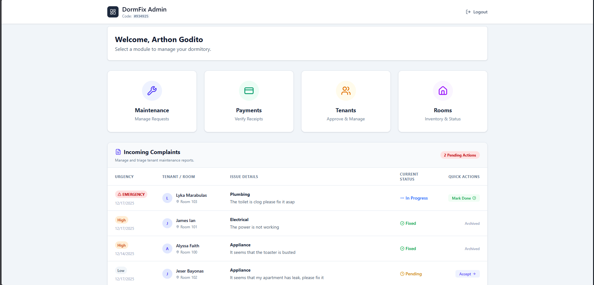
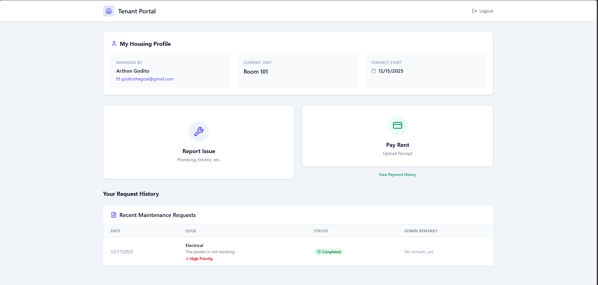

# DormFix

 **A centralized web platform for seamless dormitory management, maintenance tracking, and payment verification.**


## About The Project

**DormFix** is a full-stack web application designed to digitize the interactions between Dormitory Landlords and Tenants. It replaces manual logbooks and unverified text messages with a centralized dashboard for managing room assignments, tracking rent payments, and filing maintenance requests.

Built to address the specific needs of local boarding houses, DormFix ensures transparency, accountability, and ease of use for both property managers and boarders.

## Key Features

### For Landlords (Admin)
* **Dashboard Overview:** View real-time occupancy rates and pending tasks.
* **Payment Verification:** Review proof-of-payment receipts (GCash/Bank) and approve or reject them with remarks.
* **Room Management:** Manage room inventory, set capacity limits, and assign tenants.
* **Maintenance Tracking:** Triage reported issues (Plumbing, Electrical) and update repair status.



## For Tenants
* **Housing Profile:** View assigned room details, landlord contact info, and move-in dates.
* **Digital Payments:** Securely upload payment receipts and track verification status.
* **Issue Reporting:** File maintenance requests with urgency levels and descriptions.
* **History Log:** Access a permanent record of past payments and maintenance tickets.



## Tech Stack

* **Frontend:** React (Vite) + TypeScript + Tailwind CSS
* **Backend:** Node.js + Express.js
* **Database:** Microsoft SQL Server (MSSQL)
* **State Management:** React Context API
* **File Storage:** Local Multer Storage (for receipts)

---

## Getting Started

Follow these instructions to run the project locally on your machine.

### 1. Prerequisites
Ensure you have the following installed:
* **Node.js** (v18 or higher)
* **Microsoft SQL Server Express** (2019 or later)
* **Git**

### 2. Database Setup
1.  Open **SQL Server Management Studio (SSMS)**.
2.  Create a new database named `dormfix`.
3.  Create a Login/User named `dormfix_admin` with the password `sharingan`.
    * *Note: Ensure TCP/IP is enabled in SQL Server Configuration Manager.*
4.  Run the SQL scripts provided in the `database/` folder to create the necessary tables (`users`, `rooms`, `payments`, `dorm_assignments`, `maintenance_requests`).

### 3. Backend Installation
Open a terminal and navigate to the server directory:

```bash
cd server
npm install
```
##### Create a .env file in the server folder with the following configuration:

```bash
PORT=5000
DB_USER=dormfix_admin
DB_PASSWORD=sharingan
DB_SERVER=localhost
DB_NAME=dormfix
```

#### Start the backend server:

```bash
npx ts-node src/index.ts
```
You should see: Server running on http://localhost:5000

---
### 4. Frontend Installation

Open a new terminal window and navigate to the client directory:

```bash
cd client
npm install
npm run dev
```

Start the React application:

```bash
npm run dev
```
Click the link provided (usually http://localhost:5173) to launch the application.
